# PPI-Net: Heart Rate Estimation via Pulse-to-Pulse Interval Trajectory Prediction with Interpretable Failure Diagnostics

[](https://opensource.org/licenses/MIT)
[](https://www.python.org/downloads/)
[](https://pytorch.org/get-started/locally/)

Official implementation of **PPI-Net**, a novel framework that redefines Heart Rate (HR) estimation from wrist-worn PPG by learning dense **Pulse-to-Pulse Interval (PPI) trajectories** instead of traditional scalar regression.

## 📌 Overview

Accurate HR estimation from PPG during physical activity is often hindered by motion artifacts and the loss of temporal information when compressing multi-beat windows into single scalar values. 

**PPI-Net** addresses these challenges by:
- **Redefining the Target:** Shifting from a single scalar HR to a **128-point PPI trajectory** across a 64-second window.
- **Rich Supervision:** Providing 128x denser gradient feedback compared to standard methods.
- **Multi-Modal Fusion:** A triple-encoder architecture processing raw PPG, STFT spectrograms, and 3-axis accelerometry.
- **Interpretability:** A structured failure taxonomy (Types A-D) to move beyond "black-box" predictions.

---

## 🏗️ Architecture

PPI-Net employs a **1D-2D Triple Encoder** frontend followed by a temporal refinement module:

1.  **1D ResNet (PPG):** Extracts local morphological features from raw signals.
2.  **2D ResNet (STFT):** Captures frequency-domain dynamics from spectrograms.
3.  **1D ResNet (ACC):** Processes 3-axis accelerometer data to cancel motion artifacts.
4.  **Bi-GRU Residual Module:** A lightweight (~4K params) module for long-range temporal modeling of PPI.

---
## Framework


## 🚀 Key Features

- **Decoupled Learning:** Decouples feature-extraction failures from conversion-level errors via PPI representation.
- **Domain Adaptation:** Uses Instance Normalization and Domain-Adversarial Gradient Reversal for robust cross-subject generalization.
- **Center-Weighted Supervision:** 3x loss weighting on the evaluation-critical central segment.
- **Auxiliary HR Loss:** prevent "PPI collapse" (degenerate constant-output) using an auxiliary scalar loss ($\lambda=0.1$).

---

## 📊 Performance (on PPG-DaLiA)

Evaluated under strict **Leave-One-Subject-Out (LoSo)** cross-validation on all 15 subjects:

| Metric | Value |
| :--- | :--- |
| **Mean Absolute Error (MAE)** | **3.30 ± 1.71 BPM** |
| **Median MAE** | 2.67 BPM |
| **Pearson Correlation (r)** | 0.943 |
| **Post-processing** | None |

> **Finding:** Error variation is driven by morphological fidelity (Signal Quality Index, $r = -0.813$), not the HR range itself ($r = -0.013$).

---

## 🔍 Diagnostic Framework (Failure Taxonomy)

Unlike traditional models, PPI-Net allows for mechanistic error analysis:

- **Type A (Learning Collapse):** Degenerate constant outputs (mitigated by auxiliary loss).
- **Type B (Alignment Error):** Objective-evaluation misalignment.
- **Type C (Physiological OOD):** Input dynamics outside the trained distribution.
- **Type D (Morphological Outlier):** Extreme motion artifacts or sensor decoupling.

---

## 🛠️ Installation & Usage

### Prerequisites
- Python 3.8+
- PyTorch 1.10+
- NumPy, SciPy, Matplotlib

### Setup
```bash
git clone https://github.com/your-username/PPI-Net.git
cd PPI-Net
pip install -r requirements.txt
